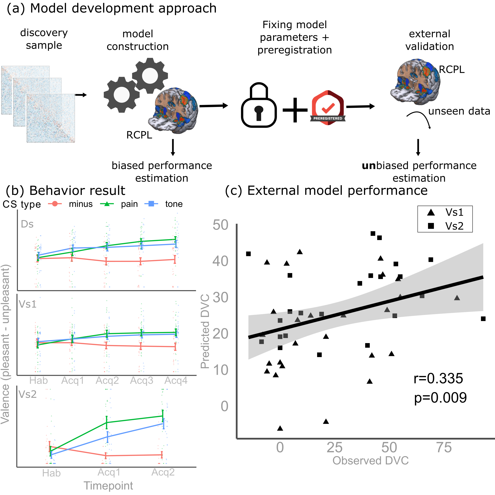

RCPL signature (Resting-state functional Connectivity signature of Pain-related Learning)
==========================

  

You can read more about the training, validation, specificity test, model interpretation in our Communications Biology paper: [Kincses et al](https://doi.org/10.1038/s42003-024-06574-y).

Laboratory for Predictive Neuroimaging - University Hospital Essen, Germany

This repo contains the main analysis steps related to develop and validate th RCPL signature (Resting-state functional Connectivity signature of Pain-related Learning).

Information about the study design and the project can be found in the preregistration <https://osf.io/b8znd/> of the study.

For the preprocessing of the resting-state data, the following pipeline were used <https://github.com/pni-lab/PUMI> . The latest version of the pipeline also provides RCPL scores.
